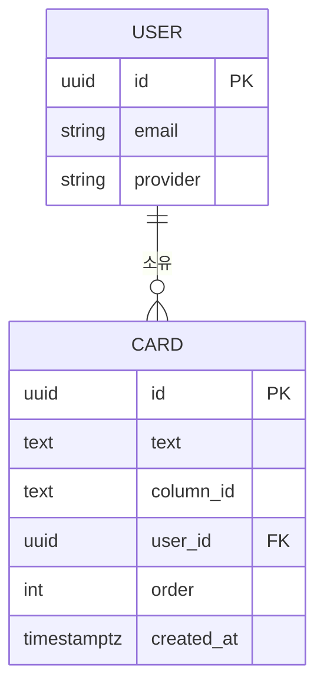

# Data Model
## Kanban Board

> 카드 데이터는 **Supabase PostgreSQL DB**에 저장됩니다.
> RLS(Row Level Security)로 사용자별 데이터를 격리합니다.

---

## 1. 핵심 엔티티

### User (사용자) — Supabase Auth 관리

| 필드 | 타입 | 설명 |
|------|------|------|
| `id` | `uuid` | Supabase Auth 자동 생성 UUID |
| `email` | `string` | 로그인 이메일 |
| `user_metadata.full_name` | `string?` | Google OAuth 표시 이름 |
| `user_metadata.user_name` | `string?` | GitHub OAuth 표시 이름 |
| `app_metadata.provider` | `string` | 로그인 제공자 (`google` / `github` / `email`) |

> User 테이블은 Supabase가 `auth.users`로 자동 관리. 별도 생성 불필요.

### Card (카드) — `public.cards` 테이블

| 필드 | 타입 | 설명 | 예시 |
|------|------|------|------|
| `id` | `uuid` | PK, `gen_random_uuid()` 자동 생성 | `"a1b2c3d4-..."` |
| `text` | `text` | 카드 표시 텍스트 | `"요구사항 분석"` |
| `column_id` | `text` | 소속 컬럼 (`todo` / `in-progress` / `done`) | `"todo"` |
| `user_id` | `uuid` | FK → `auth.users(id)`, RLS 기준 | Supabase Auth UUID |
| `order` | `int` | 컬럼 내 정렬 순서 | `0` |
| `created_at` | `timestamptz` | 생성 시각 | `2026-05-13T10:00:00Z` |

---

## 2. Supabase DB 스키마

`supabase_schema.sql` 참조 — Supabase SQL Editor에서 실행.

```sql
create table if not exists cards (
  id         uuid primary key default gen_random_uuid(),
  text       text not null,
  column_id  text not null check (column_id in ('todo', 'in-progress', 'done')),
  user_id    uuid not null references auth.users(id) on delete cascade,
  "order"    int  not null default 0,
  created_at timestamptz default now()
);

alter table cards enable row level security;

create policy "본인 카드만 조회" on cards for select using (auth.uid() = user_id);
create policy "본인 카드만 추가" on cards for insert with check (auth.uid() = user_id);
create policy "본인 카드만 수정" on cards for update using (auth.uid() = user_id);
create policy "본인 카드만 삭제" on cards for delete using (auth.uid() = user_id);
```

---

## 3. DOM과 데이터 매핑

| DB 필드 | DOM 요소 | 속성 |
|---------|----------|------|
| `Card.id` | `<div class="card">` | `data-card-id` (Supabase UUID) |
| `Card.user_id` | `<div class="card">` | `data-user-id` |
| `Card.text` | `<div class="card">` | `textContent` |
| `Card.column_id` | 카드의 부모 section | `card.closest('.column').id` |
| `Card.order` | DOM 순서 | `querySelectorAll('.card')` 인덱스 |
| `User.id` | `currentUser.id` (전역 변수) | — |

---

## 4. 데이터 흐름

```
로그인
  → loadCards(userId)
  → Supabase SELECT * FROM cards WHERE user_id = userId ORDER BY "order"
  → 결과 없음 → insertInitialCards(userId) → 초기 7개 INSERT
  → renderBoard(cards): flat 배열을 DOM으로 렌더링

카드 추가
  → Supabase INSERT { text, column_id, user_id, order } RETURNING *
  → 반환된 UUID를 card.dataset.cardId에 설정

카드 이동 / 순서 변경
  → DOM 조작 후 saveCards()
  → 전체 카드를 Supabase UPSERT (onConflict: 'id')
```

---

## 5. 사용자 인증 방식

| 제공자 | Supabase 메서드 | 계정 격리 |
|--------|-----------------|-----------|
| Google OAuth | `signInWithOAuth({ provider: 'google' })` | UUID 기준 독립 계정 |
| GitHub OAuth | `signInWithOAuth({ provider: 'github' })` | UUID 기준 독립 계정 |
| 이메일 | `signInWithPassword` / `signUp` | UUID 기준 독립 계정 |

> 동일 이메일로 여러 제공자 로그인 시 Supabase Identity Linking 설정에 따라 계정이 통합될 수 있음.
> 제공자별 독립 계정을 원하면 Authentication → Settings에서 Identity Linking 비활성화.

---

## 6. 엔티티 관계도


