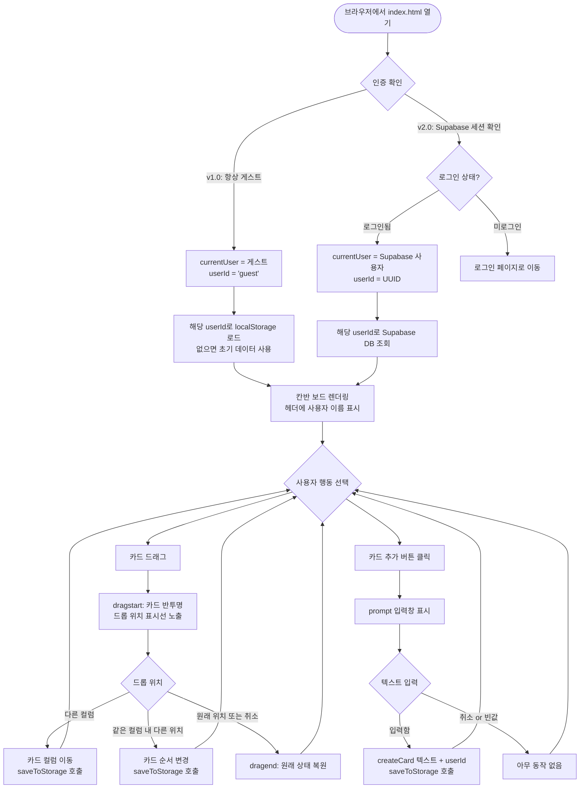
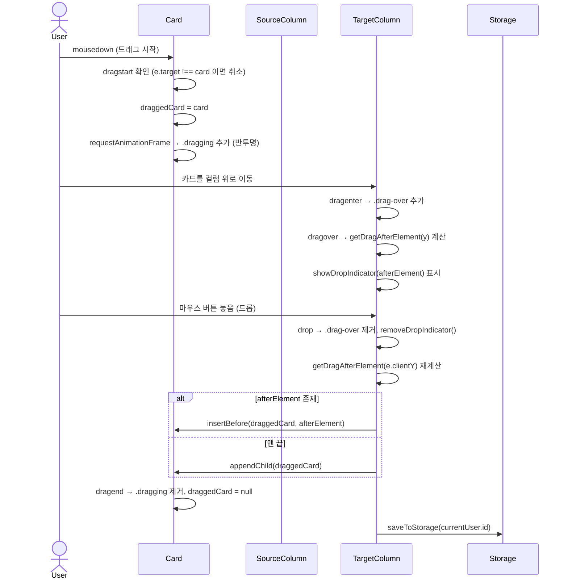
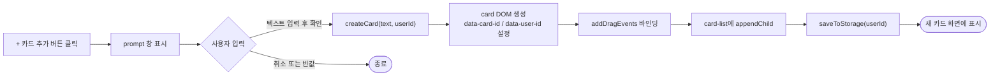
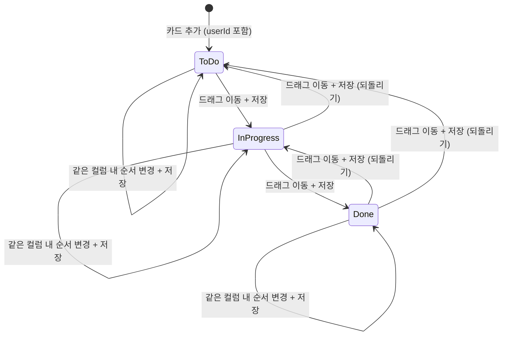
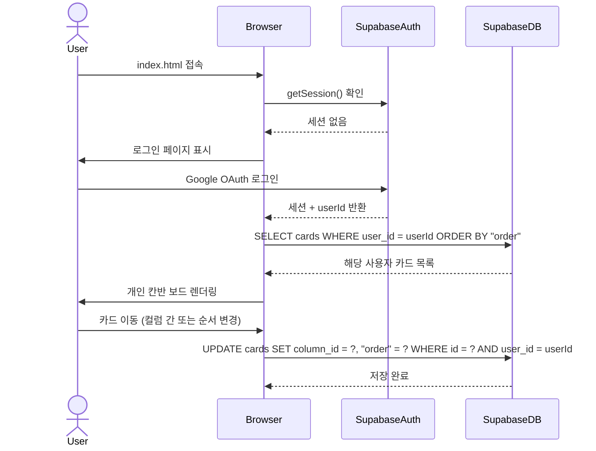

# User Flow — 사용자 흐름도
## Kanban Board

---

## 1. 전체 흐름 개요 (v1.0 + v2.0 분기 포함)

```mermaid
flowchart TD
    A([브라우저에서 index.html 열기]) --> B{인증 확인}

    B -- v1.0: 항상 게스트 --> C1[currentUser = 게스트\nuserId = 'guest']
    B -- v2.0: Supabase 세션 확인 --> C2{로그인 상태?}

    C2 -- 로그인됨 --> C3[currentUser = Supabase 사용자\nuserId = UUID]
    C2 -- 미로그인 --> C4[로그인 페이지로 이동]

    C1 --> D[해당 userId로 localStorage 로드\n없으면 초기 데이터 사용]
    C3 --> D2[해당 userId로 Supabase DB 조회]

    D --> E[칸반 보드 렌더링\n헤더에 사용자 이름 표시]
    D2 --> E

    E --> F{사용자 행동 선택}

    F --> G[카드 드래그]
    F --> H[카드 추가 버튼 클릭]

    G --> G1[dragstart: 카드 반투명\n드롭 위치 표시선 노출]
    G1 --> G2{드롭 위치}
    G2 -- 다른 컬럼 --> G3[카드 컬럼 이동\nsaveToStorage 호출]
    G2 -- 같은 컬럼 내 다른 위치 --> G4[카드 순서 변경\nsaveToStorage 호출]
    G2 -- 원래 위치 또는 취소 --> G5[dragend: 원래 상태 복원]
    G3 --> F
    G4 --> F
    G5 --> F

    H --> H1[prompt 입력창 표시]
    H1 --> H2{텍스트 입력}
    H2 -- 입력함 --> H3[createCard 텍스트 + userId\nsaveToStorage 호출]
    H2 -- 취소 or 빈값 --> H4[아무 동작 없음]
    H3 --> F
    H4 --> F
```

---

## 2. 드래그 앤 드롭 상세 흐름

```mermaid
sequenceDiagram
    actor User
    participant Card
    participant SourceColumn
    participant TargetColumn
    participant Storage

    User->>Card: mousedown (드래그 시작)
    Card->>Card: dragstart 확인 (e.target !== card 이면 취소)
    Card->>Card: draggedCard = card
    Card->>Card: requestAnimationFrame → .dragging 추가 (반투명)

    User->>TargetColumn: 카드를 컬럼 위로 이동
    TargetColumn->>TargetColumn: dragenter → .drag-over 추가
    TargetColumn->>TargetColumn: dragover → getDragAfterElement(y) 계산
    TargetColumn->>TargetColumn: showDropIndicator(afterElement) 표시

    User->>TargetColumn: 마우스 버튼 놓음 (드롭)
    TargetColumn->>TargetColumn: drop → .drag-over 제거, removeDropIndicator()
    TargetColumn->>TargetColumn: getDragAfterElement(e.clientY) 재계산
    alt afterElement 존재
        TargetColumn->>Card: insertBefore(draggedCard, afterElement)
    else 맨 끝
        TargetColumn->>Card: appendChild(draggedCard)
    end
    Card->>Card: dragend → .dragging 제거, draggedCard = null
    TargetColumn->>Storage: saveToStorage(currentUser.id)
```

---

## 3. 카드 추가 흐름

```mermaid
flowchart LR
    A[+ 카드 추가 버튼 클릭] --> B[prompt 창 표시]
    B --> C{사용자 입력}
    C -- 텍스트 입력 후 확인 --> D["createCard(text, userId)"]
    C -- 취소 또는 빈값 --> E([종료])
    D --> F[card DOM 생성\ndata-card-id / data-user-id 설정]
    F --> G[addDragEvents 바인딩]
    G --> H[card-list에 appendChild]
    H --> I["saveToStorage(userId)"]
    I --> J([새 카드 화면에 표시])
```

---

## 4. 카드 상태 전이도

```mermaid
stateDiagram-v2
    [*] --> ToDo : 카드 추가 (userId 포함)
    ToDo --> ToDo : 같은 컬럼 내 순서 변경 + 저장
    ToDo --> InProgress : 드래그 이동 + 저장
    InProgress --> InProgress : 같은 컬럼 내 순서 변경 + 저장
    InProgress --> Done : 드래그 이동 + 저장
    Done --> Done : 같은 컬럼 내 순서 변경 + 저장
    Done --> InProgress : 드래그 이동 + 저장 (되돌리기)
    InProgress --> ToDo : 드래그 이동 + 저장 (되돌리기)
    Done --> ToDo : 드래그 이동 + 저장 (되돌리기)
```

---

## 5. v2.0 인증 흐름 (Supabase — 향후)

```mermaid
sequenceDiagram
    actor User
    participant Browser
    participant SupabaseAuth
    participant SupabaseDB

    User->>Browser: index.html 접속
    Browser->>SupabaseAuth: getSession() 확인
    SupabaseAuth-->>Browser: 세션 없음

    Browser->>User: 로그인 페이지 표시
    User->>SupabaseAuth: Google OAuth 로그인
    SupabaseAuth-->>Browser: 세션 + userId 반환

    Browser->>SupabaseDB: SELECT cards WHERE user_id = userId ORDER BY "order"
    SupabaseDB-->>Browser: 해당 사용자 카드 목록
    Browser->>User: 개인 칸반 보드 렌더링

    User->>Browser: 카드 이동 (컬럼 간 또는 순서 변경)
    Browser->>SupabaseDB: UPDATE cards SET column_id = ?, "order" = ? WHERE id = ? AND user_id = userId
    SupabaseDB-->>Browser: 저장 완료
```
